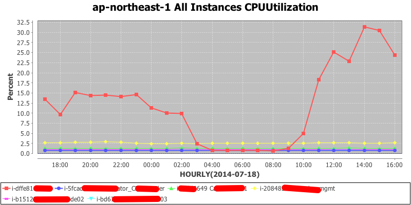

JMCloud-WatchCloud-Lib
======================

Public Cloud Monitoring Library For Generating AWS System Monitoring Data & Chart

## Prerequisites:
* JAVA 1.6 or above
* [JMLab Java Utility Libraries](https://github.com/JM-Lab/utils)
* [JMLab CLI Helper](https://github.com/JM-Lab/CLIHelper)
* [Get an AWS Account and Your AWS Credentials](http://docs.aws.amazon.com/AWSSdkDocsJava/latest/DeveloperGuide/java-dg-setup.html#java-dg-signup)
* [Set up your AWS Credentials for Use with the SDK for Java](http://docs.aws.amazon.com/AWSSdkDocsJava/latest/DeveloperGuide/java-dg-setup.html#set-up-creds)

## Installation

Checkout the source code:

    git clone https://github.com/JM-Lab/JMCloud-WatchCloud-Lib.git
    cd JMCloud-WatchCloud-Lib
    mvn install

## Usage
Set up pom.xml :

    (...)
    <dependency>
			<groupId>jmcloud</groupId>
			<artifactId>jmcloud-watchcloud-lib</artifactId>
			<version>0.1.1</version>
	</dependency>
    (...)
    
## CLI Example
build package and execute jar :

	mvn package
	# Usage : java -jar target/jmcloud-watchcloud-lib-0.1.1-jar-with-dependencies.jar [IntervalInMinutes] [MonitoringCount] [Region] [MetricName] [ResultDirectory]
	java -jar target/jmcloud-watchcloud-lib-0.1.1-jar-with-dependencies.jar 60 24 ap-northeast-1 CPUUtilization testout
	
then you can get graphs and json type info of all instances in the region !!!

 
